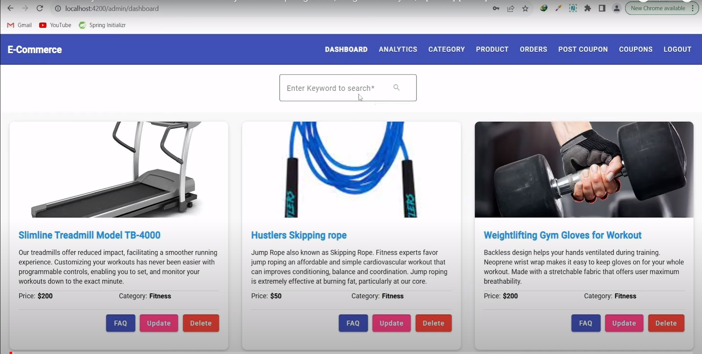

# E-Commerce Project

## Overview

This E-Commerce project is built with Angular for the frontend and Spring Boot for the backend, using MySQL as the database. The goal is to create a seamless online shopping experience with a user-friendly interface and a robust backend.



## Features

- **User Authentication:** Secure user registration and login functionality.
- **Product Catalog:** Browse through a diverse catalog of products with detailed information.
- **Shopping Cart:** Add products to the cart, review, and proceed to checkout.
- **Order Management:** View order history and track the status of current orders.
- **Admin Panel:** Manage products, users, and orders through a dedicated admin interface.

## Technologies Used

- **Frontend:**
  - Angular: A powerful and dynamic frontend framework for building responsive web applications.
  - HTML/CSS: Standard web technologies for structuring and styling the user interface.
  - TypeScript: The programming language used in conjunction with Angular for building scalable applications.

- **Backend:**
  - Spring Boot: A Java-based framework for building enterprise-level applications with ease.
  - Spring Security: Ensures secure user authentication and authorization.
  - Spring Data JPA: Simplifies database interactions with Java Persistence API.

- **Database:**
  - MySQL: A relational database management system for storing product, user, and order data.

## Getting Started

1. **Clone the Repository:**
   ```bash
   git clone https://github.com/AryanP45/E-commerce
   cd E-commerce
   ```

2. **Set Up Backend:**
   - Configure your MySQL database settings in the `application.properties` file.
   - Run the Spring Boot application.

3. **Set Up Frontend:**
   - Navigate to the `E-commerce-web` directory.
   - Install dependencies: `npm install`
   - Start the Angular application: `ng serve`

4. **Access the Application:**
   - Open your browser and go to `http://localhost:4200` to access the E-Commerce application.

## Contributing

Contributions are welcome! Please follow the guidelines in the `CONTRIBUTING.md` file.

## License

This project is licensed under the [MIT License](LICENSE.md).

## Acknowledgments

- Thanks to the Angular, Spring Boot, and MySQL communities for providing excellent documentation and support.

Feel free to modify this README to match the specifics of your project. Best of luck with your E-Commerce project using MySQL!